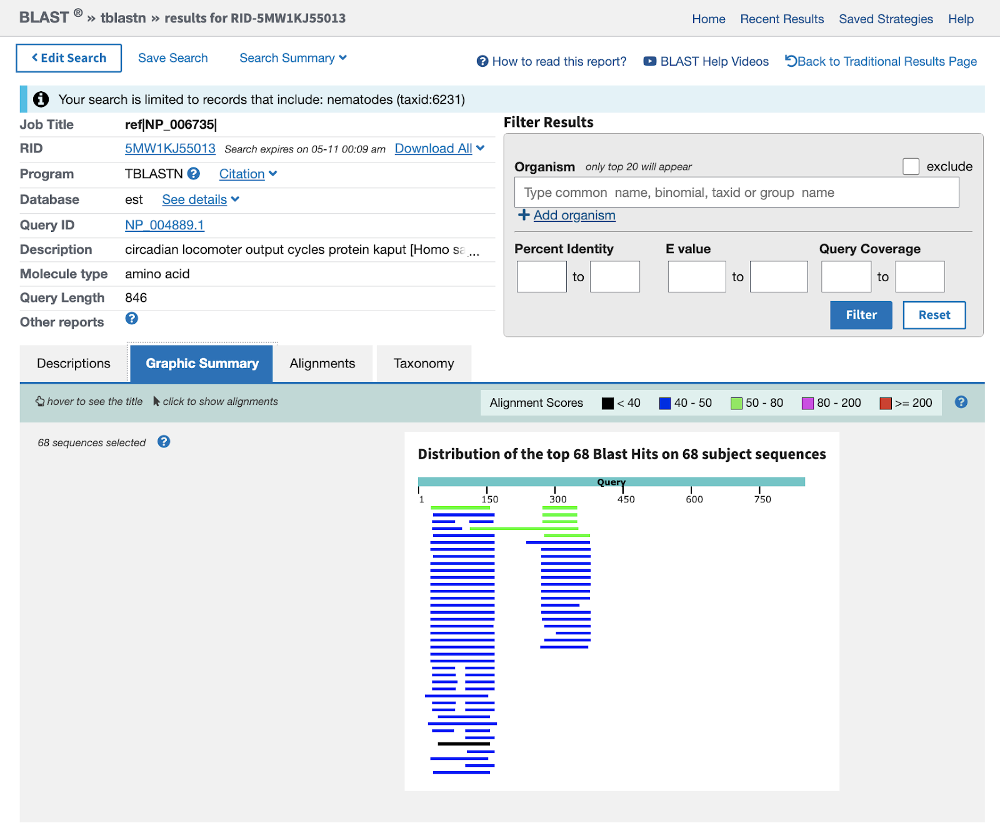
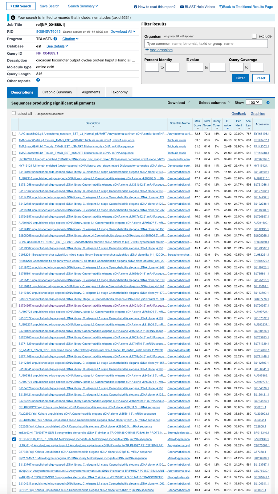
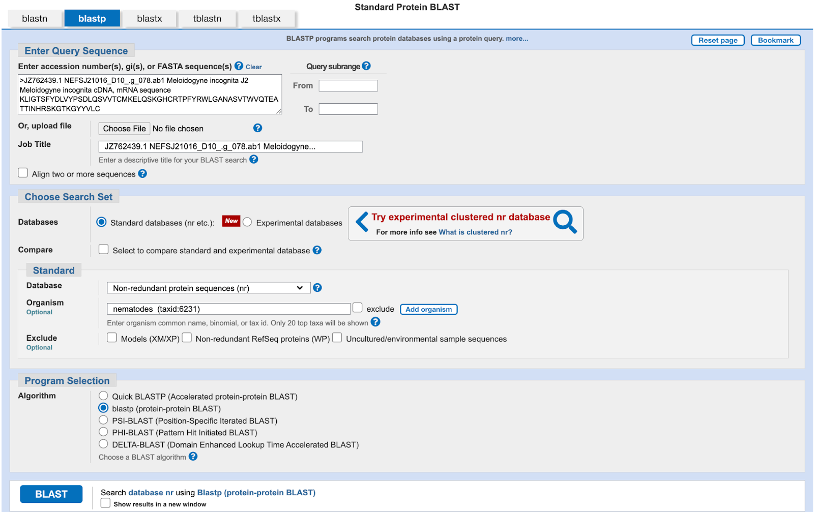
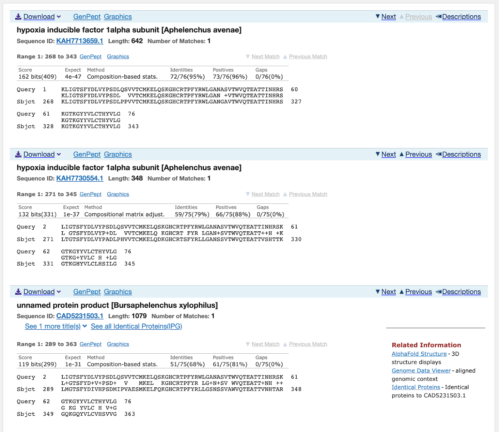
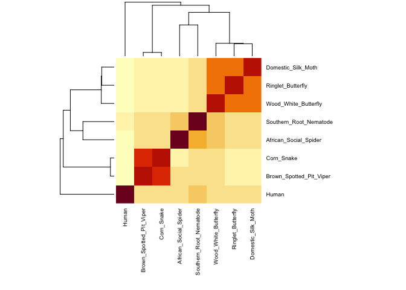
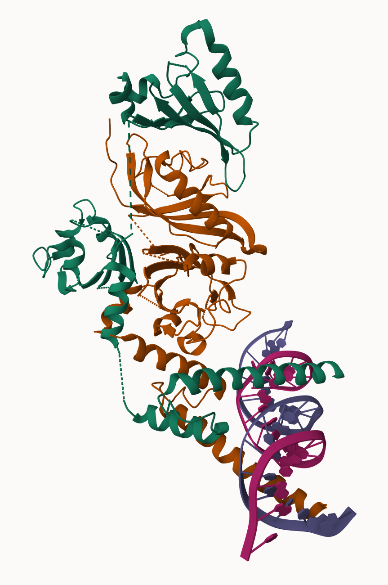
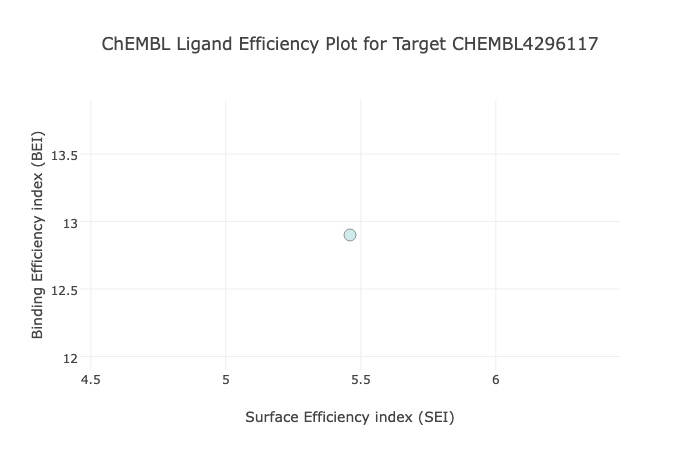

# Find-a-gene Project

Izabelle Querubin,
[iquerubi\@ucsd.edu](mailto:iquerubi@ucsd.edu){.email}, A16015750

## Q1. **Tell me the name of a protein you are interested in. Include the species and the accession number. This can be a human protein or a protein from any other species as long as its function is known.**

**If you do not have a favorite protein, select human RBP4 or KIF11. Do
not use beta globin as this is in the worked example report that I
provide you with online.**

Protein: CLOCK

Accession number: NP_004489.1

Species: Homo sapiens

Function known: Encodes a protein that plays a central role in the
regulation of circadian rhythms---a transcription factor of the basic
helix-loop-helix (bHLH) family, containing DNA binding histone
acetyltransferase activity. May be associated with behavioral changes in
certain populations, and with obesity and metabolic syndrome.

## Q2. **Perform a BLAST search against a DNA database, such as a database consisting of genomic DNA or ESTs. The BLAST server can be at NCBI or elsewhere. Include details of the BLAST method used, database searched and any limits applied (e.g. Organism).**

Method: TBLASTN (2.71.1) search against nematode ESTs

Database: Expressed sequence tags (est)

Organism: Nematodes (Taxid: 6231)

## **On the BLAST results, clearly indicate a match that represents a protein sequence, encoded from some DNA sequence, that is homologous to your query protein.**

Chosen match: Accession JZ762439, a 789 base pair clone from Meloidogyne
incognita (southern root-knot nematode). See below for alignment
details.






## Q3. **Gather information about this "novel" protein.**

```         
>JZ762439.1 NEFSJ21016_D10_.g_078.ab1 Meloidogyne incognita J2 Meloidogyne incognita cDNA, mRNA sequence
ACGCGCCACACACCGGATATGCGCTTCAGCTACGTCAGCGACGGCTGGAACATTCCGTGCCGCGACGGGC
ACCGAAAACTCATCGGCACCTCCTTCTACGACCTCGTCTACCCGTCGGACCTGCAGTCAGTGGTCACCTG
CATGAAGGAGCTGCAGTCCAAGGGCCATTGCCGCACTCCGTTCTACCGCTGGCTCGGCGCGAATGCCTCG
GTAACGTGGGTCCAGACCGAAGCGACCACCATCAACCACCGCAGCAAGGGCACGAAGGGTTACTATGTGC
TGTGCACCCATTACGTGCTGGGCAACCAGAACGAGATGGAGTCATGGGAGACGCCGTGCTCAGCGTTCAA
CTCTGCCGCAAGGCCAGTGATGACCCGCGTCAAGGCGGAGATTGACGACATCTCAGACTACTGCTTCGGA
CACCAGCAGCCAGGTGTGGAGTGCGTCGATGTTGAGCCACTTGCCGAGTTCTTCCCTCAGTGCTTCGATC
AGGTGGACCAGCGCTCACGGCAGAAGCCCTATCACCCACGCCATGCCAACATGGGCCTGGACGGCGACAG
CGAATTCGACGCCGTCCTGCAGTGGCTCTTCCGCGAGGACGATGACGCTCCGCCACAGTGCGACTCTTGC
CTTACGGTCCCTGCCGGTCGCAGTCGGTGTCAGTCCAATCCCGACGGCATGAAGCGGTCCGCAGCCTACA
TGGCACAGCAGCAGCCAGCCCCGGCATCGGCCTACGGCTCGGCGTTGGACGTCAATCAGTTGTCGGCGGG
TGATATCGCGCAGCCGATG
```

### Chosen sequence:

Name: Hypoxia inducible factor 1 alpha subunit

Species: Meloidogyne incognita;

Eukaryota; Metazoa; Ecdysozoa; Nematoda; Chromadorea; Rhabditida;
Tylenchina; Tylenchomorpha; Tylenchoidea; Meloidogynidae;
Meloidogyninae; Meloidogyne; Meloidogyne incognita group.

## Q4. **Prove that this gene, and its corresponding protein, are novel. For the purposes of this project, "novel" is defined as follows. Take the protein sequence (your answer to** Q3), and use it as a query in a blastp search of the nr database at NCBI.






## Q5. **Generate a multiple sequence alignment with your novel protein, your original query protein, and a group of other members of this family from different species.**

### Relabeled sequences:

```         
>Human | NP_004889.1 circadian locomoter output cycles protein kaput [Homo sapiens]\nMLFTVSCSKMSSIVDRDDSSIFDGLVEEDDKDKAKRVSRNKSEKKRRDQFNVLIKELGSMLPGNARKMDK\nSTVLQKSIDFLRKHKEITAQSDASEIRQDWKPTFLSNEEFTQLMLEALDGFFLAIMTDGSIIYVSESVTS\nLLEHLPSDLVDQSIFNFIPEGEHSEVYKILSTHLLESDSLTPEYLKSKNQLEFCCHMLRGTIDPKEPSTY\nEYVKFIGNFKSLNSVSSSAHNGFEGTIQRTHRPSYEDRVCFVATVRLATPQFIKEMCTVEEPNEEFTSRH\nSLEWKFLFLDHRAPPIIGYLPFEVLGTSGYDYYHVDDLENLAKCHEHLMQYGKGKSCYYRFLTKGQQWIW\nLQTHYYITYHQWNSRPEFIVCTHTVVSYAEVRAERRRELGIEESLPETAADKSQDSGSDNRINTVSLKEA\nLERFDHSPTPSASSRSSRKSSHTAVSDPSSTPTKIPTDTSTPPRQHLPAHEKMVQRRSSFSSQSINSQSV\nGSSLTQPVMSQATNLPIPQGMSQFQFSAQLGAMQHLKDQLEQRTRMIEANIHRQQEELRKIQEQLQMVHG\nQGLQMFLQQSNPGLNFGSVQLSSGNSSNIQQLAPINMQGQVVPTNQIQSGMNTGHIGTTQHMIQQQTLQS\nTSTQSQQNVLSGHSQQTSLPSQTQSTLTAPLYNTMVISQPAAGSMVQIPSSMPQNSTQSAAVTTFTQDRQ\nIRFSQGQQLVTKLVTAPVACGAVMVPSTMLMGQVVTAYPTFATQQQQSQTLSVTQQQQQQSSQEQQLTSV\nQQPSQAQLTQPPQQFLQTSRLLHGNPSTQLILSAAFPLQQSTFPQSHHQQHQSQQQQQLSRHRTDSLPDP\nSKVQPQ\n\n>Southern_Root_Nematode | JZ762439.1 NEFSJ21016_D10_.g_078.ab1 Meloidogyne incognita J2 Meloidogyne incognita cDNA, mRNA sequence,\nKLIGTSFYDLVYPSDLQSVVTCMKELQSKGHCRTPFYRWLGANASVTWVQTEATTINHRSKGTKGYYVLCTHYVLG\n\n>Wood_White_Butterfly | XP_050671994.1 hypoxia-inducible factor 1-alpha-like isoform X5 [Leptidea sinapis]\nMCFNVDGAPCQYTNVVDLEDFMNNEKRKEKSRVAARCRRTKEMQIFAEMTAALPAKKEMVEQLDKSSVMRLAISYLRVRD\nIVSLLPADTEPPKLKSPKGLEEIQSELSYMKALDGFVLVLSQQGDIIYCSDNITEHLGVSQMEIMGQSVFEFSHPCDHEE\nIREALRSNGAGRRDLLLRLKCTLTSKGRNVHIKSASYKVIHMTGHMLTPDKESNNNDEEGKKDLKKPTNGALIAVGRPIP\nHPSNIEVPLDTKTFLTKHSLDMKFTYTDEGLLNALGFESDELVGCSLYDYHHAADSASLVQQFKSLFSKGQCETGQYRFL\nGKSGGYAWIQTQATVITDKQQKPSFVVCVNYVISGIECKDEVFAAHQVQHADLKPAVAALPATAVPICDNPAPANGAIVG\nVILPEEERPIPVTELIFAPREKEMNKGFLMFSQNKGITSEWMLNRDSLVLKDEPEDLTHLAPTAGDAHILLENSPFDMFD\nDFILNDNYCSLLGDDLANGSPVDSLIGDSLLSSPERQENESTGEQSSLLTELSLDAFDSARSDTDIDDGNSPFIPTTDEL\nPVLEPAVMWGALPDSVRQARPQPSEIQSSSPALQRLLVAPPTGPPPQDIITNIYSEQGLIPSRNISSWDTGVKRIMKQEE\nEPTAKRIKRSPTPTPTQTSTSSSVLMNLLVSGCDVDAGYICMVQCRPRHKAKA\n\n>African_Social_Spider | XP_035210551.1 hypoxia-inducible factor 1-alpha-like isoform X1 [Stegodyphus dumicola]\nMCGGKVAIPPIVKEKRRNSEKRKEKSRDAARCRRSKESEIFSDLSGQLPLAPGVASALDKASIMRLTVGYLKVREMMKIL\nIPCGRTVTGSSNDSIYAAVLNGFLLVLSEEGDIIYLSENVEEFIGISQVDMMGHSVYDFSHPCDHEDIKQVLAPKISEKI\nQIKTDNFGRETISFFVRMKSTVKSKGRTMNLKSAAYQVIHYIGHRFDKPRGVEDDDKCPTFYLVFIGKTIPHPAQIDVPL\nDKDIFVSRHSPDMKFTHIDERISEFLGFTNSELIGQSAYSFHHPLDAQTVFSAFKTLFSKGQCETGYYRFLSKYGGYVWL\nVTQATVIYENGTKPECVVCLNYVLSKVENGHEIVSGQQEQSIKEKEEAEDENICVAEEEGSPSEPPVLLSSTRVIFAPKE\nSVMSKDFLNFPDADLQDLDLEPPLEKIPCSVVNSATLNQNVLFQESLKDTKLNLEFDFFQDDPCTLENGISEDPFISYRD\nDSLSSPSYCGTPESSLNLHTSNSTSPDRFNTTPGTPDSGSLSDIPSLDPIDEFSNLDLKFTMPPSASDDSECCDENLDFR\nAPYISMNMDDDFPLISPSSSVMWGPQEPAPKKLPQERLPEIEPQRISPPKQKPVTENLNSSLAALLQSDVKKTPQSKQEK\nNAVARRESNSHKRWSGSSADNNKSSSLKQRPFNPSKGYGNGGHIIMLDSIPVKKQNSKSNASQRRTAQPSASDRRSNSPP\nFGSHTATVKVNDRLIKVQVSVSELPTSPIEHKQPFPSPPDPPPKRTSPSRLGPTESPKRLKVDNGLICSGPQGFASDSVL\nLNLLISGEDASRGYLCSGNSRYSDSKFESAMLSLSSDDSSSKQTNDSSSNCTELLASESELLDFLKISQYDAEVNAPIQS\nSHLLQGDDLLSALDHQPLLRNVPALV\n\n>Domestic_Silk_Moth | XP_037876182.1 hypoxia-inducible factor 1-alpha isoform X4 [Bombyx mori]\nMSTKPANQKRRNNEKRKEKSRVAARCRRTKEMQIFSELTAALPAKKEEVEQLDKASVMRLAISYLRVRDVVSMLPDVNSD\nQSKMQNPEGFEELASELSYMRALDGFVLVLSQQGDIVYCSDNIAEHLGVSQMEIMGQSVFEFSHPCDHDEIREALRTNGG\nARRDLLLRLKCTLTSKGRNVHLKSASYKVIHITGHMLASTEDNERNNNETKADEEKKGKAGCLVAVGRPIPHPSNIEIPL\nDSKTFLSKHSLDMKFTYVDESLLNTLGFGSEELVGRSLYDYHHAADSASMIQQFKSLFSKGQCETGQYRFLAKSGGYSWV\nQTQATVITDKQQKPISVVCVNYIISGIECKDEVFAAHQVQHADLKPKLPAVASPGVSFRAPVEPLANGAIVAIVPPEEER\nPIPVTELIFAPRKKEMNKGFLMFSQDEGLTSEWLFNQSLVLKDEPEDLTHLAPTAGDACIPLENSPFDMFDEFILSDNYC\nSLLGDDLANGSPVDPLAPDPSLLSSPESQENDSSCEQSSLLTELSLDAFDNTRSDEIDDSNSPFIPISDELPVLEPAVMW\nGALPDSVSQARPQPSETHTSPAPALQRLLTGPPPQDLITSIYSDQGLMPSRSISTWDTGVKRVMKEEEEPSAKRVKRSPS\nPVAPKPKSQSSSVLMNLLDIPQQSTPHKQPMKANYQILPNTQMLGLQNVLHRNMQVPIINITQAVPNKHVMRASTPINQM\nRTNMTTGPMSPLSLNIGSPMYSLPSSPNSYSSPAMSPAQRERVMSPYSTPQSLSPVGKFHQMYSPGQRMVSPTGVIQGSD\nPYLTTKMQPSPGFPMQVNDILLDTNVQLPTSDFWADPEFLQGTSDLLTAFDDVKLG\n\n>Ringlet_Butterfly | XP_034834054.1 hypoxia-inducible factor 1-alpha isoform X4 [Maniola hyperantus]\nMIKSEMASKPTNQKRRNNEKRKEKSRVAARCRRTKEMQIFVELTAALPAKKEEVEQLDKASVMRLAISYLRVRDVVSMLP\nEDKEAPKLQSPKGLEEVQSELSYMNALDGFVLVLSQQGDIVYCSENIADHLGVSQMEIMGQSVFEFSHPCDHDEIRESLR\nAGNDGRRDLLLRLKCTLTSKGRNVHLKSASYKVIHVTGHMITPTEEKTKDQDLSTDSDEEKKEVKSYTNTGALVAVGRPI\nPHPSNIETPLNSMTFLTKHSLDMKFTYTDEGLTNSLGFESEELVGRSLYEYHHAADSASLAQQFKSLFSKGQCETGQYRF\nLAKTGGYSWVQTQATVITDKQQKPISVICVNYVISGIECKDEVFAAHQVHHADLKPVVAPAPLIRVSTEPPANGAIVGIV\nAPEEERPIPVTEQIFVPRKKEMNKGFLMFSQNEGLTSESHSNCKSLVLKDEPEDLTHLAPTAGDACISLENNSPFDMFDD\nFMLNDNYCSLLGDDLANGSPVDSLIADSLLSSPEPQETESSCEQSSLLTELSLDAFDNRSDNDIDDGNSPFIPTTDELPL\nLEPAVMWGVLPDSVSQAKPQPSEVQTSAPALQRLLAAPPTGPPPQDIITNIYSDPGLIPSRSVSSWDTGVKRVMKQEEES\nTAKRVKRSPSPAAPTARTPSSSVLMNLLDIHPQAKQQIRQQLRSNYQMSLNTPRTSPQSPVNKNLPVPVINIIRSGPNEP\nLMRANTTAPNPPMIRTSPMSPLTLNVGSPMYSLPSSPNTPNYSPAMSPAQKDRVLSPYSTPQSLSPAGSYMYSPNNKLLS\nPSGVMRGYDPYLNNKMQTSPGFPLQSDMLLDTNMPLASTDFWPDSDMLQGTSDLLTAFDDVKLV\n\n>Corn_Snake | XP_034294080.1 hypoxia-inducible factor 3-alpha isoform X3 [Pantherophis guttatus]\nMSWSKYQRSTTEIRKEKSRDAARCRRSKETEVFYQLAHTLPFARGVSAHLDKASIMRLTISYLRMHKLLNSGEWRDQVKA\nEEQVDSYYLKALDGFLMVLTEEGDMIYLSENVNKHLGLSQLELIGHSVFDFIHPCDQEELQDVLSPRQGFSKKAEVKTER\nNFSLRMKSTLTTRGRTVNLKSATWKVLHCSGHMRSYAPSKPATGKEGEGGFAEPPLRCLVLICEAIPHPANIETPLDSGT\nFLSRHTMDMKFTYCDDRIVEMAGYTSESLLGCSLYEYIHALDSDSVSKSINTLLSKGQAVTGQYRFLARNGGYIWIQTEA\nTVISSSKNSQPESIVCIHFVLSQVEENGLVLSLEQTDRQGEHRRLPPPCLEGLDSDSALEEMDPNGGDTIINLSFELRGP\nKILAFLRPANISEEELQLDPKRFCSPDLQKLLGPIFDPPGTQNSAGGTGRAKPPAPVPKTAPVVKKMSGNHNLSDLPEEL\nIFDMENVQKLFASNKEEQSMETALQDYEGLDLEMLAPYISMDDDFQLSSTDHPPWLTEKRGDPGAGPRPASPPPRPRSRS\nFHGVSPRPPEPAPLPRWGSDSSLSQGRPIETPLANSPCGEGQMVEMVASVKIQSVQDGTGLNGQRSPLGGRKRTREISLD\nEERDLFLETIPPKRAHNHEAEGFLMPSLSLGFLLSVEECLDARSERGCGGTVALGKKLLALEEPMGLLGDMLPFVVDGPA\nLSQLALYDGEEEVSGRGGEHFQLGEELLVELDQAT\n\n>Brown_Spotted_Pit_Viper | XP_029140890.1 hypoxia-inducible factor 3-alpha [Protobothrops mucrosquamatus]\nMPRCVQNMSPEKLGSSSATIGHPNTGEKGSTTEIRKEKSRDAARCRRSKETEVFYQLAHTLPFARGVSAHLDKASIMRLT\nISYLRMHKLLNSGEWRDQVKAEEQVDSYYLKALDGFLMVLTEEGDMIYLSENVNKHLGLSQLELIGHSVFDFIHPCDQEE\nLQDVLSPRQGFSKKGEVKTERNFSLRMKSTLTTRGRTVNLKSATWKVLHCSGHMRCYAPSKPAAGKEGEGGFTEPPLRCL\nVLICEAILHPANIETPLDSGTFLSRHTMDMKFTYCDDRIVEMAGYTSESLLGCSLYEYIHALDSDSVSKSINTLLSKGQA\nVTGQYRFLARNGGYIWIQTEATVISSSKNSQPESIVCMHFVLSQVEENGLVLSLEQTDRQGEHRRLPPPCLEGLDSESAL\nDEMDPNGGDTIINLSFELRGPKILAFLRPANISEEELQLDPKRFCSPDLQKLLGPIFDPPGTQNSAGGAVRAKLPAPIAK\nLAPVVKKASGNHDSAWLPFPLGTLCSPLQDYEGLDLEMLAPYISMDDDFQLSSTDHPPWLAEKRRDPAGAGARPVSPPPR\nPRSRSFHGVSPRPPEAPTLPRWGSDSSLSQGRPVETPLANSPCGEGQMVEMVASVKIQSVQDGAGLNGHRSPLGGKKRAR\nEISLDEERDLFLETSPPKRAHNHEAEGFLMPSLSLGFLLSVEECLDARSERGCGGTVALGKKLLALEEPMGLLGDMLPFV\nVDGPALSQLALYDGEEEVSGRGGEHFQLGEELLVELDQAT
```

### Alignment using EBI's MUSCLE:

```         
CLUSTAL multiple sequence alignment by MUSCLE (3.8)\n\n\nHuman                        MLFTVSCSKMSSIVDRDDSSIFDGLVEEDDKDKAKRVSRNKSEKK-RRDQFNVLIKELGS\nCorn_Snake                   ----------------------MSWSKYQRSTTEIRKEKSRDAARCRRSKETEVFYQLAH\nBrown_Spotted_Pit_Viper      -MPRCVQNMSPEKLGSSSATIGHPNTGEKGSTTEIRKEKSRDAARCRRSKETEVFYQLAH\nDomestic_Silk_Moth           --------------------MSTKPANQKRRNNEKRKEKSRVAARCRRTKEMQIFSELTA\nWood_White_Butterfly         ---------MCFNVDGAPCQYTNVVDLEDFMNNEKRKEKSRVAARCRRTKEMQIFAEMTA\nRinglet_Butterfly            ---------------MIKSEMASKPTNQKRRNNEKRKEKSRVAARCRRTKEMQIFVELTA\nSouthern_Root_Nematode       ------------------------------------------------------------\nAfrican_Social_Spider        --------------MCGGKVAIPPIVKEKRRNSEKRKEKSRDAARCRRSKESEIFSDLSG\n                                                                                         \n\nHuman                        MLP---GNARKMDKSTVLQKSIDFLRKHKEITAQSD-ASEIRQDWKPTFLSNEEFTQLML\nCorn_Snake                   TLPFARGVSAHLDKASIMRLTISYLRMHKLLN---------SGEWRDQVKAEEQVDSYYL\nBrown_Spotted_Pit_Viper      TLPFARGVSAHLDKASIMRLTISYLRMHKLLN---------SGEWRDQVKAEEQVDSYYL\nDomestic_Silk_Moth           ALPAKKEEVEQLDKASVMRLAISYLRVRDVVSMLPDVNSDQSKMQNPEGFEELASELSYM\nWood_White_Butterfly         ALPAKKEMVEQLDKSSVMRLAISYLRVRDIVSLLPA-DTEPPKLKSPKGLEEIQSELSYM\nRinglet_Butterfly            ALPAKKEEVEQLDKASVMRLAISYLRVRDVVSMLPE-DKEAPKLQSPKGLEEVQSELSYM\nSouthern_Root_Nematode       ------------------------------------------------------------\nAfrican_Social_Spider        QLPLAPGVASALDKASIMRLTVGYLKVREMMKILIP---------CGRTVTGSSNDSIYA\n                                                                                         \n\nHuman                        EALDGFFLAIMTDGSIIYVSESVTSLLEHLPSDLVDQSIFNFIPEGEHSEVYKILSTHLL\nCorn_Snake                   KALDGFLMVLTEEGDMIYLSENVNKHLGLSQLELIGHSVFDFIHPCDQEELQDVLSPR--\nBrown_Spotted_Pit_Viper      KALDGFLMVLTEEGDMIYLSENVNKHLGLSQLELIGHSVFDFIHPCDQEELQDVLSPR--\nDomestic_Silk_Moth           RALDGFVLVLSQQGDIVYCSDNIAEHLGVSQMEIMGQSVFEFSHPCDHDEIREALRTN--\nWood_White_Butterfly         KALDGFVLVLSQQGDIIYCSDNITEHLGVSQMEIMGQSVFEFSHPCDHEEIREALRSN--\nRinglet_Butterfly            NALDGFVLVLSQQGDIVYCSENIADHLGVSQMEIMGQSVFEFSHPCDHDEIRESLRAG--\nSouthern_Root_Nematode       ------------------------------------------------------------\nAfrican_Social_Spider        AVLNGFLLVLSEEGDIIYLSENVEEFIGISQVDMMGHSVYDFSHPCDHEDIKQVLAPKIS\n                                                                                         \n\nHuman                        ESDSLTPEY-LKSKNQLEF---CCHMLRGTIDPKEPSTYEYVKFIGNFKSLNSVSS-SAH\nCorn_Snake                   --QGFSKKAEVKTERNFSLRMKSTLTTRGRTVNLKSATWKVLHCSGHMRSYAPSKPATGK\nBrown_Spotted_Pit_Viper      --QGFSKKGEVKTERNFSLRMKSTLTTRGRTVNLKSATWKVLHCSGHMRCYAPSKPAAGK\nDomestic_Silk_Moth           ----------GGARRDLLLRLKCTLTSKGRNVHLKSASYKVIHITGHMLASTEDNE-RNN\nWood_White_Butterfly         ----------GAGRRDLLLRLKCTLTSKGRNVHIKSASYKVIHMTGHMLTPDKESNNNDE\nRinglet_Butterfly            ----------NDGRRDLLLRLKCTLTSKGRNVHLKSASYKVIHVTGHMITPTEEKTKDQD\nSouthern_Root_Nematode       ------------------------------------------------------------\nAfrican_Social_Spider        EKIQIKTDNFGRETISFFVRMKSTVKSKGRTMNLKSAAYQVIHYIGH-----------RF\n                                                                                         \n\nHuman                        NGFEGTIQRTHRPSYEDRVCFVATVRLATPQFIKEMCTVEEP--NEEFTSRHSLEWKFLF\nCorn_Snake                   EGEGGFAEPPLR-------CLVLICEA-----IPHPANIETPLDSGTFLSRHTMDMKFTY\nBrown_Spotted_Pit_Viper      EGEGGFTEPPLR-------CLVLICEA-----ILHPANIETPLDSGTFLSRHTMDMKFTY\nDomestic_Silk_Moth           NETKADEEKKGKAG-----CLVAVGRP-----IPHPSNIEIPLDSKTFLSKHSLDMKFTY\nWood_White_Butterfly         EGKKDLKKPTNG-------ALIAVGRP-----IPHPSNIEVPLDTKTFLTKHSLDMKFTY\nRinglet_Butterfly            LSTDSDEEKKEVKSYTNTGALVAVGRP-----IPHPSNIETPLNSMTFLTKHSLDMKFTY\nSouthern_Root_Nematode       ------------------------------------------------------------\nAfrican_Social_Spider        DKPRGVEDDDKCPTF----YLVFIGKT-----IPHPAQIDVPLDKDIFVSRHSPDMKFTH\n                                                                                         \n\nHuman                        LDHRAPPIIGYLPFEVLGTSGYDYYHVDDLENLAKCHEHLMQYGKGKSCYYRFLTKGQQW\nCorn_Snake                   CDDRIVEMAGYTSESLLGCSLYEYIHALDSDSVSKSINTLLSKGQAVTGQYRFLARNGGY\nBrown_Spotted_Pit_Viper      CDDRIVEMAGYTSESLLGCSLYEYIHALDSDSVSKSINTLLSKGQAVTGQYRFLARNGGY\nDomestic_Silk_Moth           VDESLLNTLGFGSEELVGRSLYDYHHAADSASMIQQFKSLFSKGQCETGQYRFLAKSGGY\nWood_White_Butterfly         TDEGLLNALGFESDELVGCSLYDYHHAADSASLVQQFKSLFSKGQCETGQYRFLGKSGGY\nRinglet_Butterfly            TDEGLTNSLGFESEELVGRSLYEYHHAADSASLAQQFKSLFSKGQCETGQYRFLAKTGGY\nSouthern_Root_Nematode       --------------KLIGTSFYDLVYPSDLQSVVTCMKELQSKGHCRTPFYRWLGANASV\nAfrican_Social_Spider        IDERISEFLGFTNSELIGQSAYSFHHPLDAQTVFSAFKTLFSKGQCETGYYRFLSKYGGY\n                                           .::* * *.  :  *  .:    : * . *:  :  **:*      \n\nHuman                        IWLQTHYYITYH-QWNSRPEFIVCTHTVVSYAEVR-----AERRRELGIEE---SLPETA\nCorn_Snake                   IWIQTEATVISS-SKNSQPESIVCIHFVLSQVEENGLVLSLEQTDRQGEHR---RLPPPC\nBrown_Spotted_Pit_Viper      IWIQTEATVISS-SKNSQPESIVCMHFVLSQVEENGLVLSLEQTDRQGEHR---RLPPPC\nDomestic_Silk_Moth           SWVQTQATVIT--DKQQKPISVVCVNYIISGIECKDEVFAAHQVQHADLKP---KLPAVA\nWood_White_Butterfly         AWIQTQATVIT--DKQQKPSFVVCVNYVISGIECKDEVFAAHQVQHADLKPAVAALPATA\nRinglet_Butterfly            SWVQTQATVIT--DKQQKPISVICVNYVISGIECKDEVFAAHQVHHADLKP---VVAPAP\nSouthern_Root_Nematode       TWVQTEATTINHRSKGTKGYYVLCTHYVLG------------------------------\nAfrican_Social_Spider        VWLVTQATVIY--ENGTKPECVVCLNYVLSKVENGHEIVSGQQEQSIKEKE---EAEDEN\n                              *: *        ..  .   ::* : ::.                              \n\nHuman                        ADKSQDSGSDNRINTVSLKEALERFDHSPTPSASSRSSRKSSHTAVSDPSSTPTKIPTDT\nCorn_Snake                   LEGLDSDSAL--------------EEMDPNGGDTIINLSFELRGPKILAFLRPANISEEE\nBrown_Spotted_Pit_Viper      LEGLDSESAL--------------DEMDPNGGDTIINLSFELRGPKILAFLRPANISEEE\nDomestic_Silk_Moth           SPGVSFRAPVEPLANGAIVAIVPPEEERPIPVTELIFAPRKKEMNKGFLMFSQDEGLTSE\nWood_White_Butterfly         VPICDNPAPA----NGAIVGVILPEEERPIPVTELIFAPREKEMNKGFLMFSQNKGITSE\nRinglet_Butterfly            LIRVSTEPPA----NGAIVGIVAPEEERPIPVTEQIFVPRKKEMNKGFLMFSQNEGLTSE\nSouthern_Root_Nematode       ------------------------------------------------------------\nAfrican_Social_Spider        ICVAEEEGS-------------PSEPPVLLSSTRVIFAPKESVMSKDFLNFPDADLQDLD\n                                                                                         \n\nHuman                        STPPRQHLP---AHEKMVQRRSSFSSQ----------------------SINSQSVGSSL\nCorn_Snake                   LQLDPKRFC---SPDLQKLLGPIFDPP----------------------GTQNSAGGTGR\nBrown_Spotted_Pit_Viper      LQLDPKRFC---SPDLQKLLGPIFDPP----------------------GTQNSAGGAVR\nDomestic_Silk_Moth           WLFN-QSLVLKDEPEDLTHLAPTAGDACIPLE-NSPFDMFDE-------FILSDNYCSLL\nWood_White_Butterfly         WMLNRDSLVLKDEPEDLTHLAPTAGDAHILLE-NSPFDMFDD-------FILNDNYCSLL\nRinglet_Butterfly            SHSNCKSLVLKDEPEDLTHLAPTAGDACISLENNSPFDMFDD-------FMLNDNYCSLL\nSouthern_Root_Nematode       ------------------------------------------------------------\nAfrican_Social_Spider        LEPPLEKIPCSVVNSATLNQNVLFQESLKDTKLNLEFDFFQDDPCTLENGISEDPFISYR\n                                                                                         \n\nHuman                        TQPVMSQATNLPIPQGMSQFQFSAQLGAMQHLKDQLEQRTRMIEANIHRQQEELRKIQEQ\nCorn_Snake                   AKPPAPVPKTAPVVKKMSGNHNLSDLPEELIFDMENVQKLFASN----KEEQSMETALQD\nBrown_Spotted_Pit_Viper      AKLPAPIAKLAPVVKKASGNHDSAWLP---------------------FPLGTLCSPLQD\nDomestic_Silk_Moth           GDDLAN----GSPVDPLAPDPSLLSSPESQENDSSCEQSSLLTE----LSLDAFDNTRSD\nWood_White_Butterfly         GDDLAN----GSPVDSLIGD-SLLSSPERQENESTGEQSSLLTE----LSLDAFDSARSD\nRinglet_Butterfly            GDDLAN----GSPVDSLIAD-SLLSSPEPQETESSCEQSSLLTE----LSLDAFDN-RSD\nSouthern_Root_Nematode       ------------------------------------------------------------\nAfrican_Social_Spider        DDSLSSPSYCGTPESSLNLHTSNSTSPDRFNTTPGTPDSGSLSDIPSLDPIDEFSNLDLK\n                                                                                         \n\nHuman                        LQM------------VHGQGLQMFLQ----QSNPGLNFGSVQLSSGNSSNIQQLAPINMQ\nCorn_Snake                   YEG------------LDLEMLAPYIS--MDDDFQLSSTDHPPWLTEKRGDP-GAGPRPAS\nBrown_Spotted_Pit_Viper      YEG------------LDLEMLAPYIS--MDDDFQLSSTDHPPWLAEKRRDPAGAGARPVS\nDomestic_Silk_Moth           -EI------------DDSN--SPFIP--ISDELPVLEP--AVMWGALPDSVSQARPQPSE\nWood_White_Butterfly         TDI------------DDGN--SPFIP--TTDELPVLEP--AVMWGALPDSVRQARPQPSE\nRinglet_Butterfly            NDI------------DDGN--SPFIP--TTDELPLLEP--AVMWGVLPDSVSQAKPQPSE\nSouthern_Root_Nematode       ------------------------------------------------------------\nAfrican_Social_Spider        FTMPPSASDDSECCDENLDFRAPYISMNMDDDFPLISPSSSVMWGPQ-------EPAPKK\n                                                                                         \n\nHuman                        GQVVPTNQIQSGMNTGHIGTTQ-----------------HMIQQQTLQSTSTQSQQNVLS\nCorn_Snake                   PPPRPRSRSFHGVSPRPPEPAP------------------LPRWG--------SDSSLSQ\nBrown_Spotted_Pit_Viper      PPPRPRSRSFHGVSPRPPEAP------------------TLPRWG--------SDSSLSQ\nDomestic_Silk_Moth           THTSPAPALQRLL----TGPPPQDLITSIYSDQGLMPSRSISTWDTGVKRVMKEEEEPSA\nWood_White_Butterfly         IQSS-SPALQRLLVAPPTGPPPQDIITNIYSEQGLIPSRNISSWDTGVKRIMKQEEEPTA\nRinglet_Butterfly            VQTS-APALQRLLAAPPTGPPPQDIITNIYSDPGLIPSRSVSSWDTGVKRVMKQEEESTA\nSouthern_Root_Nematode       ------------------------------------------------------------\nAfrican_Social_Spider        LPQERLPEIEPQRISPPKQKPVTENLNSSLA--------ALLQSDVKKTPQSKQEKNAVA\n                                                                                         \n\nHuman                        GHSQQTSLP-SQTQSTLTAPLYNTMVISQPAAGSMV--------QIPSSMPQNSTQSAAV\nCorn_Snake                   GRPIETPLANSPCGEGQMVEMVASVKIQSVQDGTGLNGQ---------RSPLGGRKRTRE\nBrown_Spotted_Pit_Viper      GRPVETPLANSPCGEGQMVEMVASVKIQSVQDGAGLNGH---------RSPLGGKKRARE\nDomestic_Silk_Moth           KRVKRSPSPVAPKPKSQSSSVLMNLLDI-PQQSTPHKQPMKANYQILPNTQMLGLQNVLH\nWood_White_Butterfly         KRIKRSPTP-TPTQTSTSSSVLMNLLVSGCDVDAGY------------------------\nRinglet_Butterfly            KRVKRSPSPAAPTARTPSSSVLMNLLDIHPQAKQQIRQQLRSNYQMSLNTPRTSPQSPVN\nSouthern_Root_Nematode       ------------------------------------------------------------\nAfrican_Social_Spider        RRESNSHKRWSGSSADNNKSSSLKQRPFNPSKGYGNGGHIIMLDSIPVKKQNSKSNASQR\n                                                                                         \n\nHuman                        TTFTQDRQIRFSQGQQLVTKLVTAPVA--------CGAVMVPSTMLMGQVVTAYPTFATQ\nCorn_Snake                   ISLDEERDLFLETIPPKRAHNHE------------AEGFLMP-SLSLGFLLSVEECLDAR\nBrown_Spotted_Pit_Viper      ISLDEERDLFLETSPPKRAHNHE------------AEGFLMP-SLSLGFLLSVEECLDAR\nDomestic_Silk_Moth           RNMQVPIINITQAVPNKHVMRASTPINQ--MRTNMTTGPMSPLSLNIGSPMYSLPSSPNS\nWood_White_Butterfly         --------------------------------------------------ICMVQCRPRH\nRinglet_Butterfly            KNLPVPVINIIRSGPNEPLMRANTTAPN--PPMI-RTSPMSPLTLNVGSPMYSLPSSPNT\nSouthern_Root_Nematode       ------------------------------------------------------------\nAfrican_Social_Spider        RTAQPSASDRRSNSPPFGSHTATVKVNDRLIKVQVSVSELPTSPIEHKQPFPSPPDPPPK\n                                                                                         \n\nHuman                        QQQSQTLSVTQQQQQQSSQEQQLTSVQQPSQAQLTQPPQQFLQTSRLLHGNP---STQLI\nCorn_Snake                   SERGCGGTVALGKKLLALEEPMGLLGDMLPFVVDGPALSQLALYDG--------------\nBrown_Spotted_Pit_Viper      SERGCGGTVALGKKLLALEEPMGLLGDMLPFVVDGPALSQLALYDG--------------\nDomestic_Silk_Moth           -YSSPAMSPAQRERVMSPYSTPQSLSPVGKFHQMYSPGQRMVSPTGVIQGSDPYLTTKMQ\nWood_White_Butterfly         KAKA--------------------------------------------------------\nRinglet_Butterfly            PNYSPAMSPAQKDRVLSPYSTPQSLSPAGSY--MYSPNNKLLSPSGVMRGYDPYLNNKMQ\nSouthern_Root_Nematode       ------------------------------------------------------------\nAfrican_Social_Spider        RTSPSRLGPTESPKRLKVDNGLICSGPQG-FASDSVLLNLLISGEDASRGYLCSGNSRYS\n                                                                                         \n\nHuman                        LSAAFPLQQSTFPQSHHQQHQSQQ-------------------------------QQQLS\nCorn_Snake                   --------------------EEEVSGR----------------------------GGEHF\nBrown_Spotted_Pit_Viper      --------------------EEEVSGR----------------------------GGEHF\nDomestic_Silk_Moth           PSPGFPMQVNDILLDTNVQLPTSDFWA----------------------------DPEFL\nWood_White_Butterfly         ------------------------------------------------------------\nRinglet_Butterfly            TSPGFPLQ-SDMLLDTNMPLASTDFWP----------------------------DSDML\nSouthern_Root_Nematode       ------------------------------------------------------------\nAfrican_Social_Spider        DSKFESAMLSLSSDDSSSKQTNDSSSNCTELLASESELLDFLKISQYDAEVNAPIQSSHL\n                                                                                         \n\nHuman                        RHRTDSLPDPSKVQPQ-------\nCorn_Snake                   QLGEELLVELDQAT---------\nBrown_Spotted_Pit_Viper      QLGEELLVELDQAT---------\nDomestic_Silk_Moth           QGTSDLLTAFDDVKLG-------\nWood_White_Butterfly         -----------------------\nRinglet_Butterfly            QGTSDLLTAFDDVKLV-------\nSouthern_Root_Nematode       -----------------------\nAfrican_Social_Spider        LQGDDLLSALDHQPLLRNVPALV\n                                                    
```

## Q6. **Create a phylogenetic tree, using either a parsimony or distance-based approach. Bootstrapping and tree rooting are optional. Use "simple phylogeny" online from the EBI or any respected phylogeny program (such as MEGA, PAUP, or Phylip). Paste an image of your Cladogram or tree output in your report.**

### Phylogenetic tree using EBI's "Simple Phylogeny" feature.


## Q7. **Generate a sequence identity based heatmap of your aligned sequences using R.**

Read MUSCLE alignment file into Seaview and saved file as FASTA.

```{=html}

```
## Q8. **Using R/Bio3D (or an online blast server if you prefer), search the main protein structure database for the most similar atomic resolution structures to your aligned sequences. List the top 3 unique hits (i.e. not hits representing different chains from the same structure) along with their Evalue and sequence identity to your query. Please also add annotation details of these structures.**

First, choose the sequence with the highest identity within the
alignment.

``` r
sums <- rowSums(identity)

which.max(sums)
```

```         
Wood_White_Butterfly 
                   5 
```

In the main protein structure database, use the Wood_White_Butterfly
sequence to search for the most similar atomic resolution structure to
the aligned sequences.

``` r
wood_white <- read.fasta("woodwhite.fasta")

hits <- blast.pdb(wood_white, database = "pdb")
```

```         
 Searching ... please wait (updates every 5 seconds) RID = 8YFX1SGZ013 
 ...............................
 Reporting 37 hits
```

``` r
head(hits, 3)
```

```         
$hit.tbl
       queryid subjectids identity alignmentlength mismatches gapopens q.start
1  Query_82577     4ZPR_B   49.162             358        156        6      22
2  Query_82577     4ZP4_B   43.454             359        182        5      23
3  Query_82577     6E3T_B   43.454             359        182        5      23
4  Query_82577     6E3S_B   43.175             359        183        5      23
5  Query_82577     7V7L_B   41.257             366        195        7      19
6  Query_82577     5SY7_B   31.863             408        207        9      27
7  Query_82577     5SY5_B   30.769             403        201        9      22
8  Query_82577     4H6J_A   55.556             108         47        1     250
9  Query_82577     5TBM_A   48.182             110         56        1     249
11 Query_82577     4WN5_A   50.476             105         51        1     254
12 Query_82577     1P97_A   47.273             110         57        1     249
14 Query_82577     3F1N_A   48.182             110         56        1     249
16 Query_82577     6X21_A   48.182             110         56        1     249
18 Query_82577     2A24_A   47.664             107         55        1     252
20 Query_82577     5KIZ_A   45.455             110         59        1     249
21 Query_82577     4F3L_B   22.995             374        235        9      27
22 Query_82577     8OSJ_N   23.592             373        233       10      27
23 Query_82577     4F3L_A   25.556             360        242       10      23
24 Query_82577     8OSJ_M   25.556             360        242       10      23
25 Query_82577     8H77_E   23.662             355        218        8      48
26 Query_82577     7Y04_E   23.380             355        219        8      48
27 Query_82577     7ZUB_D   25.145             346        199        9      48
28 Query_82577     7XI4_B   26.453             344        209       13      27
29 Query_82577     7XI3_B   26.453             344        209       13      27
30 Query_82577     5Y7Y_A   29.787             141         90        3      29
31 Query_82577     5V0L_B   30.400             125         80        2      48
32 Query_82577     5NJ8_A   32.283             127         76        3      48
33 Query_82577     2KDK_A   29.060             117         81        2     241
34 Query_82577     7XHV_B   27.528             178        118        5      31
35 Query_82577     5F5Y_A   32.500              80         53        1     254
36 Query_82577     5F68_A   32.500              80         53        1     254
37 Query_82577     6QPJ_A   33.898              59         39        0     110
19 Query_82577     2A24_A   40.541              37         22        0     128
10 Query_82577     5TBM_A   40.541              37         22        0     128
15 Query_82577     3F1N_A   33.333              57         36        1     110
17 Query_82577     6X21_A   33.333              57         36        1     110
13 Query_82577     1P97_A   40.541              37         22        0     128
   q.end s.start s.end    evalue bitscore positives mlog.evalue pdb.id    acc
1    367       1   344 1.28e-116    354.0     68.44  266.853011 4ZPR_B 4ZPR_B
2    369      10   359 5.05e-102    317.0     67.69  233.244291 4ZP4_B 4ZP4_B
3    369      10   359 7.05e-102    317.0     67.69  232.910652 6E3T_B 6E3T_B
4    369      10   359  1.15e-99    311.0     67.41  227.816162 6E3S_B 6E3S_B
5    374       3   358  4.37e-91    289.0     63.93  208.060480 7V7L_B 7V7L_B
6    372       6   404  4.14e-56    197.0     48.77  127.524069 5SY7_B 5SY7_B
7    368       1   381  1.51e-49    179.0     46.90  112.414560 5SY5_B 5SY5_B
8    356       3   110  1.62e-37    137.0     75.00   84.713222 4H6J_A 4H6J_A
9    357       6   115  2.00e-32    122.0     73.64   72.989576 5TBM_A 5TBM_A
11   357       9   113  1.19e-31    120.0     71.43   71.206185 4WN5_A 4WN5_A
12   357       3   112  1.99e-31    119.0     73.64   70.692003 1P97_A 1P97_A
14   357       6   115  3.66e-31    119.0     73.64   70.082675 3F1N_A 3F1N_A
16   357       6   115  4.03e-31    119.0     73.64   69.986372 6X21_A 6X21_A
18   357       1   107  4.25e-31    118.0     72.90   69.933219 2A24_A 2A24_A
20   357       4   113  4.54e-27    107.0     70.00   60.656870 5KIZ_A 5KIZ_A
21   353      14   381  2.92e-26    112.0     44.65   58.795629 4F3L_B 4F3L_B
22   353      18   384  5.94e-26    112.0     45.58   58.085503 8OSJ_N 8OSJ_N
23   361       7   361  6.37e-24    105.0     46.11   53.410443 4F3L_A 4F3L_A
24   361      10   364  7.31e-24    105.0     46.11   53.272799 8OSJ_M 8OSJ_M
25   362      60   401  9.11e-23    103.0     42.25   50.750084 8H77_E 8H77_E
26   362      60   401  1.14e-22    102.0     41.97   50.525844 7Y04_E 7Y04_E
27   347      53   384  2.57e-22    102.0     42.49   49.712966 7ZUB_D 7ZUB_D
28   358      10   321  4.83e-14     75.5     41.57   30.661345 7XI4_B 7XI4_B
29   358      10   321  5.02e-14     75.5     41.57   30.622761 7XI3_B 7XI3_B
30   161      10   149  6.78e-13     70.9     53.19   28.019629 5Y7Y_A 5Y7Y_A
31   165      22   146  1.22e-12     69.7     54.40   27.432170 5V0L_B 5V0L_B
32   165      30   155  2.10e-11     66.2     54.33   24.586499 5NJ8_A 5NJ8_A
33   355       2   118  1.57e-10     60.5     52.99   22.574775 2KDK_A 2KDK_A
34   206       5   173  3.47e-09     58.9     48.31   19.479111 7XHV_B 7XHV_B
35   332       2    81  3.14e-07     50.4     55.00   14.973873 5F5Y_A 5F5Y_A
36   332       2    81  2.57e-06     47.8     55.00   12.871605 5F68_A 5F68_A
37   168      11    69  2.00e-03     40.8     59.32    6.214608 6QPJ_A 6QPJ_A
19   164      15    51  6.00e-03     38.5     62.16    5.115996 2A24_A 2A24_A
10   164      23    59  7.00e-03     38.5     62.16    4.961845 5TBM_A 5TBM_A
15   164       3    59  2.90e-02     36.6     50.88    3.540459 3F1N_A 3F1N_A
17   164       3    59  3.30e-02     36.6     50.88    3.411248 6X21_A 6X21_A
13   164      20    56  3.60e-02     36.2     62.16    3.324236 1P97_A 1P97_A

$raw
       queryid subjectids identity alignmentlength mismatches gapopens q.start
1  Query_82577     4ZPR_B   49.162             358        156        6      22
2  Query_82577     4ZP4_B   43.454             359        182        5      23
3  Query_82577     6E3T_B   43.454             359        182        5      23
4  Query_82577     6E3S_B   43.175             359        183        5      23
5  Query_82577     7V7L_B   41.257             366        195        7      19
6  Query_82577     5SY7_B   31.863             408        207        9      27
7  Query_82577     5SY5_B   30.769             403        201        9      22
8  Query_82577     4H6J_A   55.556             108         47        1     250
9  Query_82577     5TBM_A   48.182             110         56        1     249
10 Query_82577     5TBM_A   40.541              37         22        0     128
11 Query_82577     4WN5_A   50.476             105         51        1     254
12 Query_82577     1P97_A   47.273             110         57        1     249
13 Query_82577     1P97_A   40.541              37         22        0     128
14 Query_82577     3F1N_A   48.182             110         56        1     249
15 Query_82577     3F1N_A   33.333              57         36        1     110
16 Query_82577     6X21_A   48.182             110         56        1     249
17 Query_82577     6X21_A   33.333              57         36        1     110
18 Query_82577     2A24_A   47.664             107         55        1     252
19 Query_82577     2A24_A   40.541              37         22        0     128
20 Query_82577     5KIZ_A   45.455             110         59        1     249
21 Query_82577     4F3L_B   22.995             374        235        9      27
22 Query_82577     8OSJ_N   23.592             373        233       10      27
23 Query_82577     4F3L_A   25.556             360        242       10      23
24 Query_82577     8OSJ_M   25.556             360        242       10      23
25 Query_82577     8H77_E   23.662             355        218        8      48
26 Query_82577     7Y04_E   23.380             355        219        8      48
27 Query_82577     7ZUB_D   25.145             346        199        9      48
28 Query_82577     7XI4_B   26.453             344        209       13      27
29 Query_82577     7XI3_B   26.453             344        209       13      27
30 Query_82577     5Y7Y_A   29.787             141         90        3      29
31 Query_82577     5V0L_B   30.400             125         80        2      48
32 Query_82577     5NJ8_A   32.283             127         76        3      48
33 Query_82577     2KDK_A   29.060             117         81        2     241
34 Query_82577     7XHV_B   27.528             178        118        5      31
35 Query_82577     5F5Y_A   32.500              80         53        1     254
36 Query_82577     5F68_A   32.500              80         53        1     254
37 Query_82577     6QPJ_A   33.898              59         39        0     110
   q.end s.start s.end    evalue bitscore positives
1    367       1   344 1.28e-116    354.0     68.44
2    369      10   359 5.05e-102    317.0     67.69
3    369      10   359 7.05e-102    317.0     67.69
4    369      10   359  1.15e-99    311.0     67.41
5    374       3   358  4.37e-91    289.0     63.93
6    372       6   404  4.14e-56    197.0     48.77
7    368       1   381  1.51e-49    179.0     46.90
8    356       3   110  1.62e-37    137.0     75.00
9    357       6   115  2.00e-32    122.0     73.64
10   164      23    59  7.00e-03     38.5     62.16
11   357       9   113  1.19e-31    120.0     71.43
12   357       3   112  1.99e-31    119.0     73.64
13   164      20    56  3.60e-02     36.2     62.16
14   357       6   115  3.66e-31    119.0     73.64
15   164       3    59  2.90e-02     36.6     50.88
16   357       6   115  4.03e-31    119.0     73.64
17   164       3    59  3.30e-02     36.6     50.88
18   357       1   107  4.25e-31    118.0     72.90
19   164      15    51  6.00e-03     38.5     62.16
20   357       4   113  4.54e-27    107.0     70.00
21   353      14   381  2.92e-26    112.0     44.65
22   353      18   384  5.94e-26    112.0     45.58
23   361       7   361  6.37e-24    105.0     46.11
24   361      10   364  7.31e-24    105.0     46.11
25   362      60   401  9.11e-23    103.0     42.25
26   362      60   401  1.14e-22    102.0     41.97
27   347      53   384  2.57e-22    102.0     42.49
28   358      10   321  4.83e-14     75.5     41.57
29   358      10   321  5.02e-14     75.5     41.57
30   161      10   149  6.78e-13     70.9     53.19
31   165      22   146  1.22e-12     69.7     54.40
32   165      30   155  2.10e-11     66.2     54.33
33   355       2   118  1.57e-10     60.5     52.99
34   206       5   173  3.47e-09     58.9     48.31
35   332       2    81  3.14e-07     50.4     55.00
36   332       2    81  2.57e-06     47.8     55.00
37   168      11    69  2.00e-03     40.8     59.32

$url
                                                                                                                                                                          8YFX1SGZ013 
"https://blast.ncbi.nlm.nih.gov/Blast.cgi?CMD=Get&FORMAT_OBJECT=Alignment&ALIGNMENT_VIEW=Tabular&RESULTS_FILE=on&FORMAT_TYPE=CSV&ALIGNMENTS=20000&DESCRIPTIONS=20000&RID=8YFX1SGZ013" 
```

The top 3 unique hits are 4ZPR_B, 4ZP4_B, and 6E3T_B. Save these to a
new dataframe and add annotations: structure ID, method used to solve
the structure, resolution, and source organism.

``` r
three <- hits$hit.tbl[1:3, ]

anno <- pdb.annotate(three$pdb.id)

three_anno <- merge(three, anno, by.x = "pdb.id", by.y = "row.names")

# Only take relevant columns

relevant_colnames <- c("pdb.id", "experimentalTechnique", "resolution", "source", "evalue", "identity")

scan <- match(relevant_colnames, colnames(three_anno))

three_anno_relevant <- three_anno[, scan]

# Split PDB identifier on the underscore

ids <- three_anno_relevant$pdb.id

ids_split <- strsplit(ids, "_")

# [[ is synonymous to \$. They both select an element from a list

three_anno_relevant$pdb.id <- lapply(ids_split, "[[", 1)

three_anno_relevant
```

```         
  pdb.id experimentalTechnique resolution       source    evalue identity
1   4ZP4                 X-ray      2.355 Mus musculus 5.05e-102   43.454
2   4ZPR                 X-ray      3.902 Mus musculus 1.28e-116   49.162
3   6E3T                 X-ray      3.000 Mus musculus 7.05e-102   43.454
```

I'm not sure why the `pdb.id` column came out as a list; however,
individual cells can be viewed (example down below).

``` r
cry <- three_anno_relevant[2,1]
cry
```

```         
[[1]]
[1] "4ZPR"
```

## Q9. **Generate a molecular figure of one of your identified PDB structures using VMD. You can optionally highlight conserved residues that are likely to be functional. Please use a white or transparent background for your figure (i.e. not the default black). Based on sequence similarity. How likely is this structure to be similar to your "novel" protein?**

Molecular figure of 4ZPR downloaded from MolStar.



The sequence similarity is 49.16% for 4ZPR; therefore, this structure
from Mus musculus is only about half likely to be similar to my "novel"
protein.

## Q10. **Perform a "Target" search of ChEMBEL with your novel sequence. Are there any Target Associated Assays and ligand efficiency data reported that may be useful starting points for exploring potential inhibition of your novel protein?**

ChEMBL details 3 Binding Assays
([CHEMBL4234786](https://www.ebi.ac.uk/chembl/assay_report_card/CHEMBL4234786)
and
[CHEMBL4234788](https://www.ebi.ac.uk/chembl/assay_report_card/CHEMBL4234788))
and 1 Inhibitory Assay
([CHEMBL4219635](https://www.ebi.ac.uk/chembl/assay_report_card/CHEMBL4219635))
all in Homo Sapiens.

Ligand efficiency data below:



<https://www.ebi.ac.uk/chembl/target_report_card/CHEMBL4296117/>

Binding assay linked a description for affinity to N-terminal His6
tagged VHL (54 to 213 residues)/ELoC (17 to 112 residues)/EloB (1 to 120
residues)/HIF-1alpha (unknown origin) complex expressed in Escherichia
coli BL21(DE3). Inhibitory assay described inhibition of His-tagged
VHL/elongin B/elongin C (unknown origin) interaction with HIF1alpha.

J. Diehl, Claudia, and Alessio Ciulli. "Discovery of Small Molecule
Ligands for the von Hippel-Lindau (VHL) E3 Ligase and Their Use as
Inhibitors and PROTAC Degraders." *Chemical Society Reviews*, 19
Aug. 2022.

<https://pubs.rsc.org/en/content/articlehtml/2022/cs/d2cs00387b>
