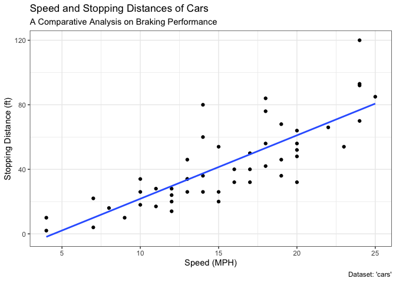
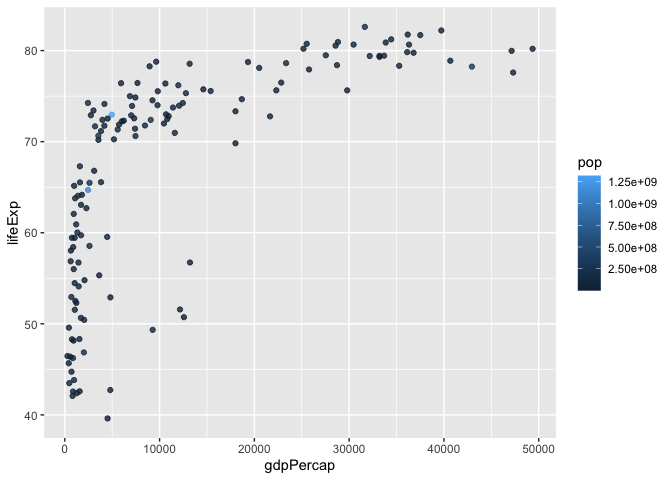

class05
================
Izabelle Querubin

# Data visualization with ggplot2

## \[2\] Background

### Q1. For which phases is data visualization important in our scientific workflows?

All of the above

### Q2. True or False? The ggplot2 package comes already installed with R?

False

## \[5\] Common Types of Plots

### Q3. Which plot types are typically NOT used to compare distributions of numeric variables?

Network Graphs

### Q4. Which statement about data visualization with ggplot2 is incorrect?

ggplot2 is the only way to create plots in R

## \[6\] Creating Scatter Plots

### Specifying a dataset with `ggplot()`

``` r
# install.packages("ggplot2")
library(ggplot2)
ggplot(cars)
```


### Specifying aesthetic mappings with `aes()`

``` r
ggplot(cars) + 
  aes(x = speed, y = dist)
```


### Specifying a geom layer with `geom_point()`

``` r
ggplot(cars) +
  aes(x = speed, y = dist) +
  geom_point()
```


### Q5. Which geometric layer should be used to create scatter plots in ggplot2?

geom_point()

### Q6. In your own RStudio can you add a trend line layer to help show the relationship between the plot variables with the `geom_smooth()` function?

``` r
ggplot(cars) +
  aes(x=speed, y=dist) +
  geom_point() +
  geom_smooth()
```

    `geom_smooth()` using method = 'loess' and formula = 'y ~ x'


### Q7. Argue with `geom_smooth()` to add a straight line from a linear model without the shaded standard error region?

``` r
ggplot(cars) +
  aes(x=speed, y=dist) +
  geom_point() +
  geom_smooth(method="lm", se=FALSE)
```

    `geom_smooth()` using formula = 'y ~ x'


### Q8. Can you finish this plot by adding various label annotations with the `labs()` function and changing the plot look to a more conservative "black & white" theme by adding the `theme_bw()`function:

``` r
ggplot(cars) + 
  aes(x=speed, y=dist) +
  geom_point() +
  labs(title="Speed and Stopping Distances of Cars",
       x="Speed (MPH)", 
       y="Stopping Distance (ft)",
       subtitle = "A Comparative Analysis on Braking Performance",
       caption="Dataset: 'cars'") +
  geom_smooth(method="lm", se=FALSE) +
  theme_bw()
```

    `geom_smooth()` using formula = 'y ~ x'



### Adding more plot aesthetics through `aes()`

``` r
url <- "https://bioboot.github.io/bimm143_S20/class-material/up_down_expression.txt"
genes <- read.delim(url)
head(genes)
```

            Gene Condition1 Condition2      State
    1      A4GNT -3.6808610 -3.4401355 unchanging
    2       AAAS  4.5479580  4.3864126 unchanging
    3      AASDH  3.7190695  3.4787276 unchanging
    4       AATF  5.0784720  5.0151916 unchanging
    5       AATK  0.4711421  0.5598642 unchanging
    6 AB015752.4 -3.6808610 -3.5921390 unchanging

### Q9. Use the `nrow()` function to find out how many genes are in this dataset. What is your answer?

``` r
nrow(genes)
```

    [1] 5196

5196 genes

### Q10. Use the `colnames()` function and the `ncol()` function on the `genes` data frame to find out what the column names are (we will need these later) and how many columns there are. How many columns did you find?

``` r
colnames(genes)
```

    [1] "Gene"       "Condition1" "Condition2" "State"     

``` r
ncol(genes)
```

    [1] 4

There are 4 columns with the following names: “Gene”, “Condition1”,
“Condition2”, “State”.

### Q11. Use the `table()` function on the `State` column of this data.frame to find out how many 'up' regulated genes there are. What is your answer?

``` r
table(genes$State)
```


          down unchanging         up 
            72       4997        127 

There are 127 ‘up’ regulated genes.

### Q12. Using your values above and 2 significant figures. What fraction of total genes is up-regulated in this data set?

``` r
round( table(genes$State)/nrow(genes) * 100, 2 )
```


          down unchanging         up 
          1.39      96.17       2.44 

2.44% of the total genes is up-regulated.

### Q13. Complete the code below to produce the following plot:

``` r
ggplot(genes) + 
    aes(x=Condition1, y=Condition2) +
    geom_point()
```


``` r
p <- ggplot(genes) + 
    aes(x=Condition1, y=Condition2, col=State) +
    geom_point()
p
```


``` r
p + scale_colour_manual( values=c("blue","gray","red") )
```


``` r
p + scale_colour_manual(values=c("blue","gray","red")) +
    labs(title="Gene Expression Changes Upon Drug Treatment",
         x="Control (no drug)",
         y="Drug Treatment")
```


## \[7\] Going Further

``` r
library(gapminder)
library(dplyr)
```


    Attaching package: 'dplyr'

    The following objects are masked from 'package:stats':

        filter, lag

    The following objects are masked from 'package:base':

        intersect, setdiff, setequal, union

``` r
gapminder_2007 <- gapminder %>% filter(year==2007)
```

### Q14. Complete the code below to produce a first basic scatter plot of this `gapminder_2007` data set:

``` r
ggplot(gapminder_2007) +
  aes(x = gdpPercap, y = lifeExp) +
  geom_point()
```


``` r
ggplot(gapminder_2007) +
  aes(x=gdpPercap, y=lifeExp) +
  geom_point(alpha=0.5)
```


### Adding more variables to `aes()`

``` r
ggplot(gapminder_2007) +
  aes(x=gdpPercap, y=lifeExp, color=continent, size=pop) +
  geom_point(alpha=0.5)
```


``` r
ggplot(gapminder_2007) + 
  aes(x = gdpPercap, y = lifeExp, color = pop) +
  geom_point(alpha=0.8)
```



### Adjusting point size

``` r
ggplot(gapminder_2007) + 
  aes(x = gdpPercap, y = lifeExp, size = pop) +
  geom_point(alpha=0.5)
```


``` r
ggplot(gapminder_2007) + 
  geom_point(aes(x = gdpPercap, y = lifeExp,
                 size = pop), alpha=0.5) + 
  scale_size_area(max_size = 10)
```


### Q15. Can you adapt the code you have learned thus far to reproduce our gapminder scatter plot for the year 1957? What do you notice about this plot? Is it easy to compare with the one for 2007?

``` r
gapminder_1957 <- gapminder %>% filter(year==1957)

ggplot(gapminder_1957) + 
  aes(x = gdpPercap, y = lifeExp, color=continent,
                 size = pop) +
  geom_point(alpha=0.7) + 
  scale_size_area(max_size = 10) 
```


Yes, this is relatively easy to compare to the plot for 2007. In 1957,
it can be observed that the overall life expectancy and GDP per capita
are lower than that of 2007; however, it is also worth noting that in
both 1957 and 2007, Africa had the lowest life expectancy *and* GDP per
capita while Europe had the highest of both.

### Q16. Do the same steps above but include 1957 and 2007 in your input data set for `ggplot()`. You should now include the layer `facet_wrap(~year)` to produce the following plot:

``` r
gapminder_1957 <- gapminder %>% filter(year==1957 | year==2007)

ggplot(gapminder_1957) + 
  geom_point(aes(x = gdpPercap, y = lifeExp, color=continent,
                 size = pop), alpha=0.7) + 
  scale_size_area(max_size = 10) +
  facet_wrap(~year)
```


